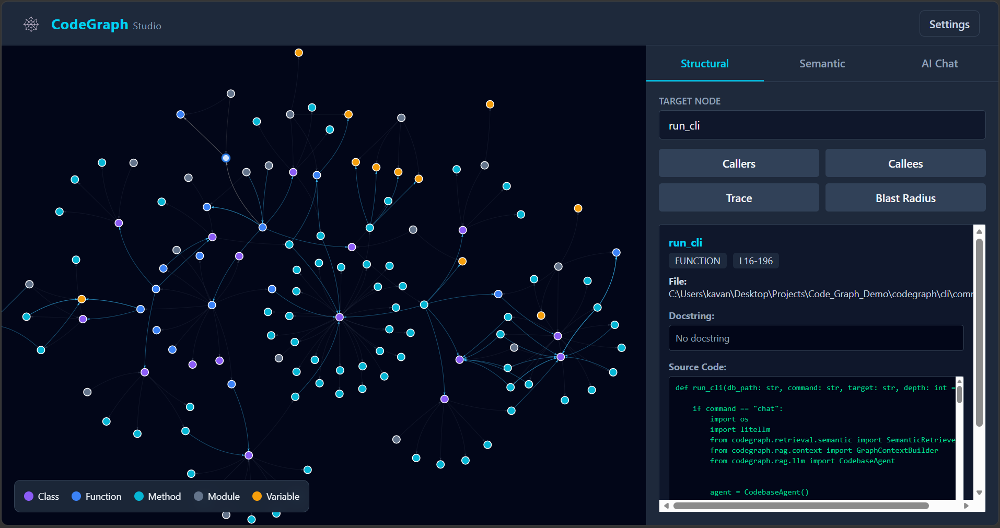
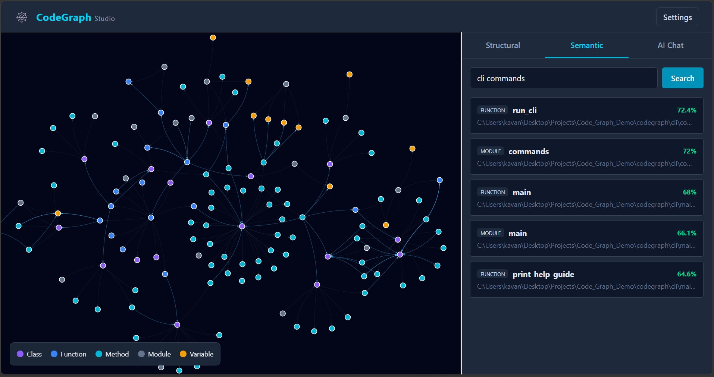
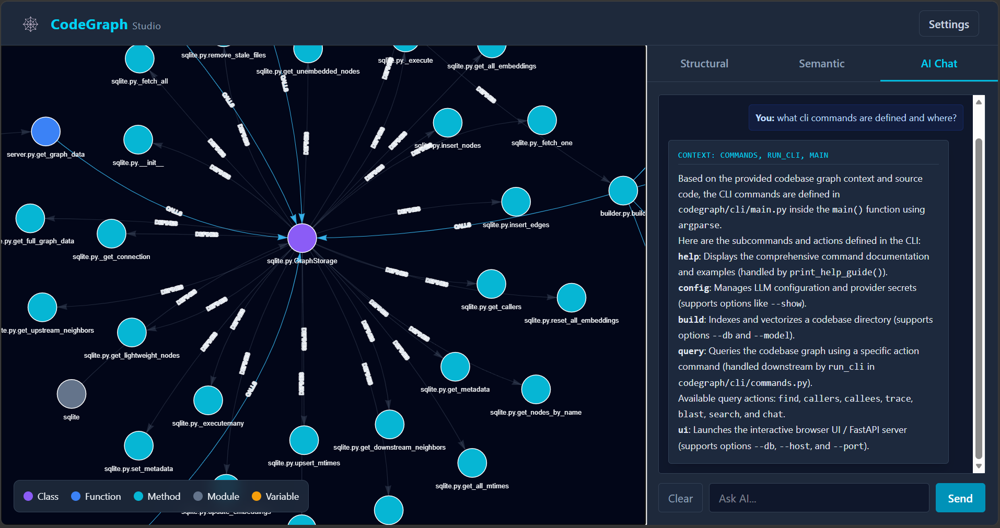

# 🕸️ CodeGraph

**Graph-Augmented Code RAG for understanding and exploring codebases.**

CodeGraph turns a codebase into a searchable knowledge graph and combines **structural code analysis, semantic search, and LLM-powered RAG** to help you understand unfamiliar projects.

It provides both a **CLI** and an interactive **web UI**.







### Features

* **Structural Search** — Find functions, methods, classes, and symbols by exact name.
* **Semantic Search** — Search code using natural-language descriptions.
* **Code Graph** — Explore callers, callees, execution paths, and dependencies.
* **Blast Radius** — Analyze what parts of a codebase may be affected by a change.
* **GraphRAG** — Ask an LLM questions about the codebase using retrieved code and its surrounding graph context.
* **Incremental Builds** — Re-index only changed parts of a codebase instead of rebuilding everything.
* **Flexible Models** — Choose from built-in embedding models or use your own Hugging Face model.
* **Local Model Caching** — Downloaded embedding models are cached locally for reuse and offline-friendly operation.
* **Configurable LLMs** — Use cloud providers or local LLMs through providers such as Ollama and LM Studio.
* **CodeGraph Studio** — Explore the generated code graph through an interactive web interface.

---

## Quick Start

### Installation

Clone the repository and install CodeGraph with `pipx`:

```bash
git clone <repository-url>
cd CodeGraph
pipx install .
```
(Don't have pipx? Install it via `pip install pipx` or `brew install pipx` first).

Once installed, the `codegraph` command is available system-wide.

---

### 1. Configure your LLM

```bash
codegraph config
```

CodeGraph supports configurable LLM providers, including:

* OpenAI
* Anthropic
* Gemini
* Ollama
* LM Studio / custom endpoints

View the active configuration with:

```bash
codegraph config --show
```

---

### 2. Build a codebase

```bash
codegraph build ./my_project
```

CodeGraph parses the project, builds its code graph, and generates embeddings for semantic search.

By default, the database is stored as:

```text
my_project/codebase_graph.db
```

Choose an embedding model with:

```bash
codegraph build ./my_project --model quality
```

Available presets:

| Preset    | Model             | Dimensions | Focus             |
| --------- | ----------------- | ---------: | ----------------- |
| `fast`    | all-MiniLM-L6-v2  |        384 | Speed             |
| `quality` | BGE-small-en-v1.5 |        384 | Balanced          |
| `strong`  | BGE-base-en-v1.5  |        768 | Retrieval quality |

You can also provide any compatible Hugging Face model:

```bash
codegraph build ./my_project \
    --model sentence-transformers/all-mpnet-base-v2
```

---

# Search Your Codebase

CodeGraph supports both **structural** and **semantic** search.

### Structural search

Find a symbol by its exact name:

```bash
codegraph query find "create_app"
```

Explore its relationships:

```bash
codegraph query callers "create_app"
```

```bash
codegraph query callees "create_app"
```

Trace downstream calls:

```bash
codegraph query trace "create_app" --depth 3
```

Analyze potential impact:

```bash
codegraph query blast "remove_stale_files" --depth 2
```

---

### Semantic search

Search using natural language:

```bash
codegraph query search "authentication token validation"
```

Control the number of results:

```bash
codegraph query search "authentication token validation" --top 3
```

This is useful when you know **what you're looking for**, but not necessarily **where it is or what it is called**.

---

# Ask Questions with GraphRAG

CodeGraph can use an LLM to answer questions about the indexed codebase:

```bash
codegraph query chat \
    "How does the incremental builder handle deleted files?"
```

For questions that require repository context, CodeGraph combines:

```text
Natural-language query
        ↓
Semantic retrieval
        ↓
Relevant code
        ↓
Code-graph context
        ↓
LLM
        ↓
Answer
```

The result is a code-aware assistant that can reason about the relationships surrounding the retrieved code rather than relying only on isolated text snippets.

Recent conversation history is also included to maintain context across questions.

---

# Incremental Indexing

After the initial build, you can simply run:

```bash
codegraph build ./my_project
```

again when the repository changes.

CodeGraph detects changes and updates the existing graph rather than unnecessarily rebuilding the entire codebase.

It handles:

* New files
* Modified files
* Deleted files
* Updated relationships
* Removal of stale graph data

This makes repeated indexing significantly more practical for actively developed repositories.

---

# CodeGraph Studio

CodeGraph also includes an interactive web interface for exploring your code graph.

Launch it with:

```bash
codegraph ui
```

By default, it runs on:

```text
http://127.0.0.1:8000
```

You can specify a different database or port:

```bash
codegraph ui --db my_project.db --port 8080
```

CodeGraph Studio provides a visual way to explore the relationships discovered during indexing.

---

# CLI Reference

| Command                            | Description                              |
| ---------------------------------- | ---------------------------------------- |
| `codegraph config`                 | Configure LLM provider and model         |
| `codegraph config --show`          | Show active configuration                |
| `codegraph build <dir>`            | Build or incrementally update a codebase |
| `codegraph query find <symbol>`    | Find a symbol                            |
| `codegraph query callers <symbol>` | Find callers                             |
| `codegraph query callees <symbol>` | Find callees                             |
| `codegraph query trace <symbol>`   | Trace downstream calls                   |
| `codegraph query blast <symbol>`   | Analyze potential impact                 |
| `codegraph query search <query>`   | Semantic search                          |
| `codegraph query chat <question>`  | Ask a GraphRAG question                  |
| `codegraph ui`                     | Launch CodeGraph Studio                  |
| `codegraph help`                   | Show CLI help                            |

Run:

```bash
codegraph help
```

for the complete CLI manual.

---

# High-Level Architecture

At a high level, CodeGraph combines three complementary capabilities:

```text
                    Codebase
                       │
             ┌─────────┴─────────┐
             │                   │
       Code Structure       Code Semantics
             │                   │
          AST Graph          Embeddings
             │                   │
             └─────────┬─────────┘
                       │
                       ▼
                  CodeGraph
                       │
          ┌────────────┴────────────┐
          │                         │
   Structural Search          Semantic Search
                                    │
                                    │
                                    ▼
                                GraphRAG
                                    │
                                    ▼
                                   LLM
```

The structural graph provides **relationships**, while semantic search provides **meaning-based retrieval**. GraphRAG combines them when answering more complex questions.

---

# Why CodeGraph?

Traditional code search is excellent when you already know what you're looking for.

Semantic search helps when you know the **concept**, but not the exact implementation.

CodeGraph combines both with the relationships that exist inside the codebase itself.

This makes it useful for questions such as:

> Where is authentication handled?

> What calls this function?

> What happens downstream of this method?

> What could be affected if I change this component?

> How does this part of the application work?

> Explain how the incremental indexing system works.

---

# Local-First

CodeGraph is designed to work well in local environments.

Embedding models are cached locally after their initial download, allowing them to be reused without downloading them again.

You can also configure a local LLM through providers such as **Ollama** or **LM Studio**, allowing the complete retrieval and generation workflow to run locally.

---

# Built With

* **Python**
* **AST-based static analysis**
* **SQLite**
* **Vector embeddings**
* **Hugging Face / Sentence Transformers**
* **Configurable LLM providers**
* **FastAPI**
* **Vis.js**

---

# Author

Made by Kavan. Feel free to contribute or report any bugs!
